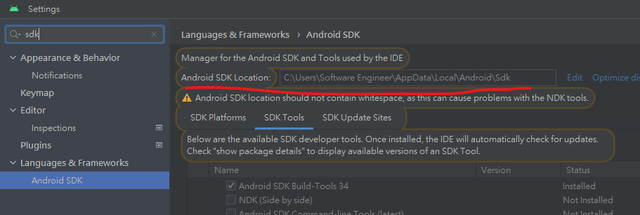

以下假設Flutter 環境變數 以及flutter sdk 安裝完成
# ```flutter doctor```

## ```flutter doctor``` 環境注意事項

### android studio 安裝完成 並且 安裝cmdline-tool(詳情見android studio 官網)
### 基本上就是從android studio 首頁抓取cmdline-tool 再到sdk mananger 的根目錄放上去就好

將 cmdline-tool 手動加入latest資料夾中

###  ```輸入flutter doctor --android-licenses``` 並告訴 flutter 接受所有flutter 的協議


配置:
如同android studio 需要將hyper-v 開啟以及 vm-acceration 等環境配置完成。必須先將hyper-v 開啟
# hyper-v 開啟方式
cmd 打開 輸入 ``` systeminfo```

最底下的四個變量都得是true

如果 firm aware 韌體的地方 不是true

代表 firm aware 必須開啟 虛擬化

進入bios (若已開啟則略過)
# bios config(若已開啟則略過)

以系統管理員身分開啟 PowerShell 主控台。

## 如果你是AMD 顯卡使用者
### 網路上大部分的資料都不會有相關的bios 配置

### 請至第一個bios 配置(左邊數來) 找尋 SVM 開啟


### 以下假設 systeminfo 四個變量皆為true
執行以下命令(``以下假設 systeminfo 四個變量皆為true``)：
```
Enable-WindowsOptionalFeature -Online -FeatureName Microsoft-Hyper-V -All
```
或者透過 介面:

以滑鼠右鍵按一下 Windows 鍵，然後選取 \[應用程式與功能\]。

選取相關設定下方右側的 [程式和功能 ]。

選取 [開啟或關閉 Windows 功能]。

選取 [Hyper-V]，然後按一下 [確定]。


# 確認方式:
再次打開systeminfo，模擬化已啟用。
再次確認:
打開 cpu 效能 查看底下詳細資訊，模擬為true

# 安裝java(如沒有請安裝)

# 最後開啟android studio 進行模擬

# flutter 模擬:
ctrl+shift+p flutter select device

加入新的android裝置

